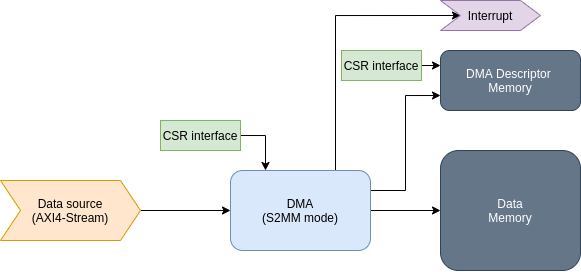

# Userspace DMA I/O

This library should simplify the use of the [Xilinx AXI DMA
controller](https://www.xilinx.com/products/intellectual-property/axi_dma.html)
when used in S2MM (Stream to Memory-Mapped) mode.

A typical use case would be a DAQ (Data Acquisition) system, where ADC
is generating data and the DMA is responsible to store the data in the memory.

A configuration required by this library is presented in the block diagram below.



## Different operation modes

### Access interface

This library supports two different access modes:

* over PCIe with [xdma](https://github.com/Xilinx/dma_ip_drivers/tree/master/XDMA) driver
* from ARM over the [Userspace I/O](https://www.kernel.org/doc/html/v5.4/driver-api/uio-howto.html)

Both methods are somehow similar, but are also different in a couple of details.

#### Memory mapping

`xdma` provides only one memory mapping for the entire register space, while
`uio` provides a separate file for each IP.

Consequently, an address of the IP needs to be provided to the `xdma` handler,
as this information is not made available.

#### Interrupts

Interrupts can be associated with an individual `uio` files, but not with the
`xdma` memory mapped file; `xdma` instead provides separate files (with the name
`eventN`).

### Data memory access

There are also two way to provide a memory for the DMA data, i.e. the
memory where the DMA is writing to:

* [u-dma-buf](https://github.com/ikwzm/udmabuf), which provides a method to
  allocate a chunk of memory from the kernel
* FPGA memory, where the memory is connected directly to the FPGA (e.g. DDR4
  memory connected directly to Programmable Logic (PL) on DAMC-FMC2ZUP)

## Python binding

Please keep in mind that on some systems (e.g. DAMC-FMC2ZUP and DAMC-FMC1Z7IO)
the `libudmaio` and the `pyudmaio` Python binding can be already installed. The
steps descibed in the chapter below are only needed for the development of the
library itself.

### Installation

The Python binding `pyudmaio` uses `setuptools` to build/install and requires
[pip 21 or
newer](https://pybind11.readthedocs.io/en/stable/compiling.html?highlight=setuptools#setup-helpers-pep518).

It also assumes the `libudmaio` header files and shared library to be installed
system-wide. Make sure to `make install` the C++ library before trying to
install the Python binding.

To install the Python library, in-tree build must be used:

```
pip install --use-feature=in-tree-build .
```

or (to install the library in [editable mode](https://pip.pypa.io/en/latest/cli/pip_install/#editable-installs):

```
pip3 install --use-feature=in-tree-build -e .
```

## Usage example

Available in the folder `example` is a small example, which demonstrates how
to use the components of this library. This example assumes that the
[AXI Traffic Generator](https://www.xilinx.com/products/intellectual-property/axi_tg.html)
is connected to the AXI4-Stream input of the DMA; this Traffic Generator IP
produces a LFSR pattern which is then compared in the interrupt handler.

### udev rules

Install TechLab's xdma metapackage (either as Debian package `xdma-dkms` from [doocs.desy.de](https://doocs.desy.de/pub/doocs/dists/) or [from source](https://github.com/MicroTCA-Tech-Lab/xdma-metapackage)) to make sure udev rules are installed to match the device file paths expected by the library.

### UIO - with default parameters

```
# ./axi_dma_demo --mode uio --debug
[2069-12-16 19:52:38.443477] [0x0000007fbce25010] [debug]   : uio name = /dev/uio5
[2069-12-16 19:52:38.444203] [0x0000007fbce25010] [debug]   : uio name = /dev/uio4
[2069-12-16 19:52:38.444769] [0x0000007fbce25010] [debug]   : uio name = /dev/uio6
[2069-12-16 19:52:38.444988] [0x0000007fbce25010] [debug]   UDmaBuf: size      = 134217728
[2069-12-16 19:52:38.445022] [0x0000007fbce25010] [debug]   UDmaBuf: phys addr = 6fd00000
[2069-12-16 19:52:38.445264] [0x0000007fbce25010] [debug]   UioAxiDmaIf: start, start_desc = 88840000
[2069-12-16 19:52:38.445651] [0x0000007fb46251c0] [debug]   DataHandlerPrint: process data, size = 16384
[2069-12-16 19:52:38.445853] [0x0000007fb46251c0] [debug]   DataHandler: stopping thread
Counters: OK = 8192, total = 8192
```

### UIO - long data acquisition

When the pause between packets is high enough (and when the packets are small
enough), the library can operate continuously - here an example where 50000
samples were captured.

```
# ./axi_dma_demo --debug --mode uio --nr_pkts 50000 --pkt_pause 60000
[2069-12-16 20:21:36.560101] [0x0000007fae16d010] [debug]   : uio name = /dev/uio5
[2069-12-16 20:21:36.560779] [0x0000007fae16d010] [debug]   : uio name = /dev/uio4
[2069-12-16 20:21:36.561316] [0x0000007fae16d010] [debug]   : uio name = /dev/uio6
[2069-12-16 20:21:36.561505] [0x0000007fae16d010] [debug]   UDmaBuf: size      = 134217728
[2069-12-16 20:21:36.561529] [0x0000007fae16d010] [debug]   UDmaBuf: phys addr = 6fd00000
[2069-12-16 20:21:36.561788] [0x0000007fae16d010] [debug]   UioAxiDmaIf: start, start_desc = 88840000
[2069-12-16 20:21:36.562072] [0x0000007fa596d1c0] [debug]   DataHandlerPrint: process data, size = 16384
[2069-12-16 20:21:36.562366] [0x0000007fa596d1c0] [debug]   DataHandlerPrint: process data, size = 16384
[2069-12-16 20:21:36.562650] [0x0000007fa596d1c0] [debug]   DataHandlerPrint: process data, size = 16384
[2069-12-16 20:21:36.562931] [0x0000007fa596d1c0] [debug]   DataHandlerPrint: process data, size = 16384
<...>
[2069-12-16 20:21:48.766523] [0x0000007fa596d1c0] [debug]   DataHandlerPrint: process data, size = 16384
[2069-12-16 20:21:48.766794] [0x0000007fa596d1c0] [debug]   DataHandlerPrint: process data, size = 16384
[2069-12-16 20:22:37.585985] [0x0000007fa596d1c0] [debug]   DataHandler: stopping thread
Counters: OK = 409600000, total = 40960000
```

### XDMA

```
$ ./axi_dma_demo --mode xdma --debug
[2021-03-01 13:49:31.941347] [0x00007f6b7e56c740] [debug]   : uio name = /dev/xdma/card0/user
[2021-03-01 13:49:31.941421] [0x00007f6b7e56c740] [debug]   : uio name = /dev/xdma/card0/user
[2021-03-01 13:49:31.941451] [0x00007f6b7e56c740] [debug]   : uio name = /dev/xdma/card0/user
[2021-03-01 13:49:31.941601] [0x00007f6b7e56c740] [debug]   UioAxiDmaIf: start, start_desc = 88920000
[2021-03-01 13:49:31.942309] [0x00007f6b7e568700] [debug]   DataHandlerPrint: process data, size = 16384
[2021-03-01 13:49:31.942382] [0x00007f6b7e568700] [debug]   DataHandler: stopping thread
Counters: OK = 8192, total = 8192
```

## Selecting the target hardware

The demo application includes hardware-related constants such as bus width and IP core addresses. To make it work, the right target hardware must be selected. The demo application currently supports DAMC-FMC2ZUP and DAMC-FMC1Z7IO.

### Hardware selection for the C++ demo

The hardware is selected at build time using a CMake parameter.
```
cmake -DTARGET_HW=ZUP
cmake -DTARGET_HW=Z7IO
```

### Hardware selection for the Python demo

The hardware is selected at runtime using a command line parameter.
```
./axi_dma_demo.py -H zup
./axi_dma_demo.py -H z7io
```

# Source code documentation

## Local build

* To create the Doxygen documentation for the library, run `doxygen` in the source tree root.
* To create the Doxygen documentation for the C++ example, run `doxygen` in the `example` directory.
* The Doxygen documentation is created in `docs/libudmaio` and `docs/example`, respectively.

## GitHub pages

The Doxygen source code documentation of the master branch is also available on [GitHub pages](https://microtca-tech-lab.github.io/libudmaio/).
